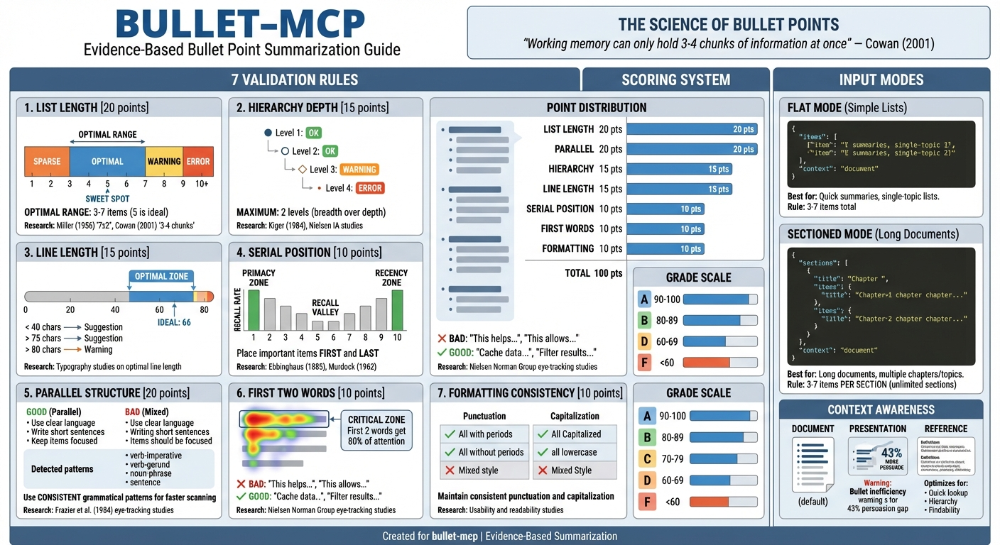

---

# bullet-mcp

MCP server for evidence-based bullet point summarization guidance. Validates and improves bullet lists using scientifically-validated principles from cognitive psychology and UX research.

## Features

- **Score bullet lists** (0-100) against 7 evidence-based rules
- **Letter grades** (A/B/C/D/F) with actionable feedback
- **Research citations** for each validation rule
- **Context awareness** (document, presentation, reference)
- **Sections support** for long documents with multiple chapters/topics

## Installation

```bash
npm install bullet-mcp
```

Or install globally:

```bash
npm install -g bullet-mcp
```

## Usage

### Claude Desktop Configuration

Add to your Claude Desktop config (`claude_desktop_config.json`):

```json
{
  "mcpServers": {
    "bullet": {
      "command": "npx",
      "args": ["bullet-mcp"]
    }
  }
}
```

### Tool: `bullet`

Validates bullet point lists against evidence-based cognitive research.

**Input:**
```json
{
  "items": [
    { "text": "Use 3-7 items per list for optimal recall", "importance": "high" },
    { "text": "Place critical information first and last" },
    { "text": "Maintain parallel grammatical structure" },
    { "text": "Keep lines between 45-75 characters" },
    { "text": "Limit hierarchy to 2 levels maximum" }
  ],
  "context": "document"
}
```

**Output:**
```json
{
  "overall_score": 97,
  "grade": "A",
  "summary": "Excellent bullet list following evidence-based best practices.",
  "top_improvements": ["Consider adding detail or combining with a related point"],
  "errors": [],
  "warnings": [],
  "suggestions": [...]
}
```

### Sectioned Mode (for long documents)

For long documents with multiple chapters or topics, use the `sections` format. Each section is validated separately (3-7 items per section), allowing unlimited total content.

**Input:**
```json
{
  "sections": [
    {
      "title": "Chapter 1: Introduction",
      "items": [
        { "text": "Define the problem scope and context" },
        { "text": "Outline key objectives and goals" },
        { "text": "Summarize the main approach taken" }
      ]
    },
    {
      "title": "Chapter 2: Methods",
      "items": [
        { "text": "Describe data collection procedures" },
        { "text": "Explain analysis methodology used" },
        { "text": "Detail validation steps performed" }
      ],
      "context": "reference"
    }
  ],
  "context": "document"
}
```

**Output includes per-section breakdown:**
```json
{
  "overall_score": 95,
  "grade": "A",
  "section_scores": [
    { "title": "Chapter 1: Introduction", "score": 96, "grade": "A", "item_count": 3 },
    { "title": "Chapter 2: Methods", "score": 94, "grade": "A", "item_count": 3 }
  ],
  "summary": "Excellent structured summary across 2 sections."
}
```

## Validation Rules

| Rule | Threshold | Research Basis |
|------|-----------|----------------|
| **List Length** | 3-7 items (5 optimal) | Miller (1956), Cowan (2001): Working memory 3-4 chunks |
| **Hierarchy** | Max 2 levels | Kiger (1984), Nielsen: 2-level structures fastest |
| **Line Length** | 45-75 chars (66 optimal) | Typography research on readability |
| **Serial Position** | Important info first/last | Ebbinghaus (1885): U-shaped retention curve |
| **Parallel Structure** | Consistent grammar | Frazier et al. (1984): Faster scanning |
| **First Words** | Unique, scannable | Nielsen eye-tracking: First 2 words critical |
| **Formatting** | Consistent punctuation | Usability research |

## Context Options

- `document` (default): Optimizes for scanning and reference
- `presentation`: Warns that visuals may be 43% more persuasive
- `reference`: Optimizes for quick lookup

## Environment Variables

| Variable | Default | Description |
|----------|---------|-------------|
| `BULLET_STRICT_MODE` | `false` | Treat warnings as errors |
| `BULLET_NO_CITATIONS` | `false` | Disable research citations in output |
| `BULLET_NO_COLOR` | `false` | Disable colored console output |

## Development

```bash
# Install dependencies
npm install

# Build
npm run build

# Test with MCP Inspector
npm run dev
```

## Research Foundation

This tool is based on `docs/bullet-study.md`, a synthesis of cognitive psychology research on optimal list design including:

- Working memory capacity (Miller, Cowan)
- Serial position effects (Ebbinghaus, Murdock)
- Eye-tracking studies (Nielsen Norman Group)
- Information architecture (Kiger, Zaphiris)
- Typography research (45-75 character optimal line length)

## License

MIT
